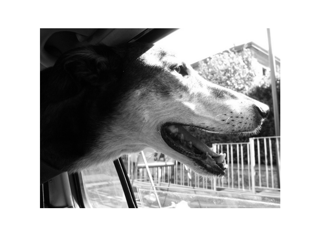
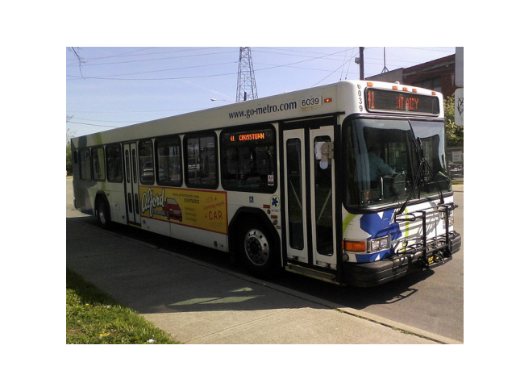

# Image Captioning

* [View Report](/CSE151B.pdf)

* To Run the Pipeline (python main.py [specific model_config])

## Usage
- Baseline model deployed here:
- https://image-caption-tool.herokuapp.com/

## Caption Examples

a group of people playing a game of frisbee .

---

a dog is looking out the window of a vehicle .

---

a bus is parked on the side of a road .

## Files
- main.py: Main driver class
- experiment.py: Main experiment class. Initialized based on config - takes care of training, saving stats and plots, logging and resuming experiments.
- dataset_factory: Factory to build datasets based on config
- model_factory.py: Factory to build models based on config
- constants.py: constants used across the project
- file_utils.py: utility functions for handling files 
- caption_utils.py: utility functions to generate bleu scores
- vocab.py: A simple Vocabulary wrapper
- coco_dataset: A simple implementation of `torch.utils.data.Dataset` the Coco Dataset
- get_datasets.ipynb: A helper notebook to set up the dataset in your workspace
